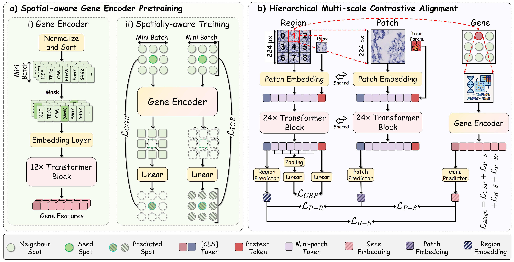
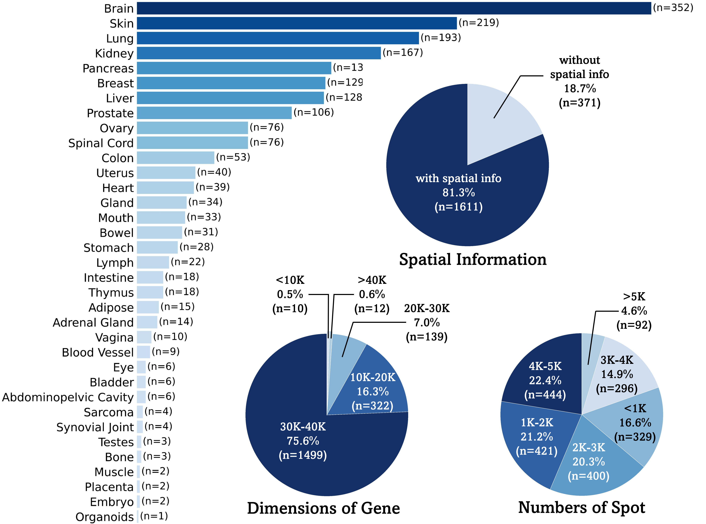

STAMP (ICLR 2026)
===========

Fusing Pixels and Genes: Spatially-Aware Learning in Computational Pathology.

ArXiv (TBD) | OpenReview (TBD)


**Abstract:** Recent years have witnessed remarkable progress in multimodal learning within computational pathology. Existing models primarily rely on vision and language modalities; however, language alone lacks molecular specificity and offers limited pathological supervision, leading to representational bottlenecks. In this paper, we propose **STAMP**, a Spatial Transcriptomics-Augmented Multimodal Pathology representation learning framework that integrates spatially-resolved gene expression profiles to enable molecule-guided joint embedding of pathology images and transcriptomic data. Our study shows that self-supervised, gene-guided training provides a robust and task-agnostic signal for learning pathology image representations. Incorporating spatial context and multi-scale information further enhances model performance and generalizability. To support this, we constructed SpaVis-6M, the largest Visium-based spatial transcriptomics dataset to date, and trained a spatially-aware gene encoder on this resource. Leveraging hierarchical multi-scale contrastive alignment and cross-scale patch localization mechanisms, STAMP effectively aligns spatial transcriptomics with pathology images, capturing spatial structure and molecular variation.
We validate STAMP across six datasets and four downstream tasks, where it consistently achieves strong performance. These results highlight the value and necessity of integrating spatially resolved molecular supervision for advancing multimodal learning in computational pathology.

---




## Highlights
- **Molecule-guided supervision:** uses spatial transcriptomics gene expression as a task-agnostic supervisory signal for pathology representation learning.
- **Spatial-aware gene encoder:** models spatial co-localization patterns among Visium spots at scale (SpaVis-6M).
- **Hierarchical multi-scale alignment:** aligns pathology image patches and gene profiles with multi-scale contrastive objectives.
- **Cross-scale localization:** encourages patch-level spatial grounding across magnifications.

## Installation
This repo contains the core STAMP model components (gene encoder + visual prompt learner + alignment objectives) and a runnable pipeline for tokenization + encoding.

Recommended environment:
- Python >= 3.9
- PyTorch + torchvision

Minimal packages you will likely need:
- `numpy`, `pandas`, `scipy`, `tqdm`, `h5py`, `Pillow`
- `pytorch-lightning`
- `timm` (UNI visual backbone)
- `scanpy`, `anndata` (for `.h5ad` I/O and ST preprocessing)
- `opencv-python` (WSI patch cropping for quick experiments)


## Data Overview



### SpaVis-6M (dataset)
SpaVis-6M is a large-scale Visium-based spatial transcriptomics corpus used to train the spatial-aware gene encoder:
- **5.75M** spatial transcriptomics entries
- **35** organs, **1,982** slices, **262** datasets/publications
- Alignment pretraining uses **697K** paired pathology image–gene expression samples

## Stage-1: Spatial-aware Gene Encoder (SpaVis-6M)
STAMP first trains a spatially-aware gene encoder on large-scale spatial transcriptomics (SpaVis-6M) to capture spot states and neighborhood co-localization patterns.

Key ingredients (paper-level):
- Spatial sampling strategy over spots and neighborhoods
- A neighborhood training objective to model spatial co-occurrence

Implementation notes:
- The gene encoder is implemented in `models/_visiumformer_saptial.py` (Transformer over tokenized genes; optional `spatial_aware` objective).

## Stage-2: Image–Gene Alignment Pretraining
STAMP then performs multimodal alignment between pathology images and spatial gene profiles.

Key ingredients:
- Hierarchical multi-scale contrastive alignment
- Cross-scale patch localization mechanism
- A unified alignment loss combining inter-modal matching, intra-modal multi-scale consistency, and localization

Implementation notes:
- The multimodal alignment model is implemented in `models/_stamp.py`.
- Visual prompt learners are implemented in `models/_prompt_learner.py` (UNI and CONCH are supported).

## Quickstart: Tokenize a Raw ST `.h5ad` and Encode with a Pretrained STAMP
This repo provides `tokenize_and_encode.py` to:
1) tokenize a raw spatial transcriptomics `.h5ad` into a fixed-length gene token sequence, and
2) crop paired image patches from a WSI image, and
3) compute normalized STAMP embeddings for both modalities.

### Expected folder layout (default)
By default, the script looks for:
```bash
hest/
  ├── st/
  │   └── <SAMPLE>.h5ad
  └── wsis/
      └── <SAMPLE>.tif
```

### Run
```bash
python tokenize_and_encode.py \
  --sample <SAMPLE> \
  --root_dir ./hest \
  --device cuda:0
```

### Notes
- The checkpoint path and backbone weights are configured in `config_files/_config_finetune_stamp.py`. Update:
  - `sweep_config["pretrained_path"]` (STAMP checkpoint)
  - `visual_config["pretrained_path"]` (e.g., UNI weights)
  - `spot_config["pretrained_path"]` (optional gene encoder pretrain)
- Patch size is adjusted by magnification (read from `--meta_csv`, default `HEST_v1_0_2.csv`). If not found, a safe default is used.
- Current script prints the embedding shapes; adapt it to save `.npz`/`.pt` outputs for downstream use if needed.

## H5-based Training Data Format (reference)
For large-scale training, the dataloaders in `data/datamodules.py` expect sharded `.h5` files (e.g., `tokens-*.h5`) containing some of the following datasets:
- `tokenized_gene`: `(N, context_length)` int tokens
- `images`: `(N, 3, 224, 224)` uint8 patches
- `images_aug`: augmented patches for multi-scale objectives
- `batch_slide_id`, `batch_dataset_id`: integer ids
- `pos_label`: cross-scale localization target

## Citation
If you find our work useful, please cite:
```bibtex
@article{STAMP_TBD,
  title   = {STAMP: Spatial Transcriptomics-Augmented Multimodal Pathology Representation Learning},
  author  = {TBD},
  journal = {TBD},
  year    = {TBD}
}
```

## Acknowledgements
- TBD
